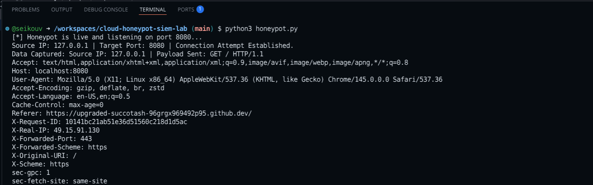
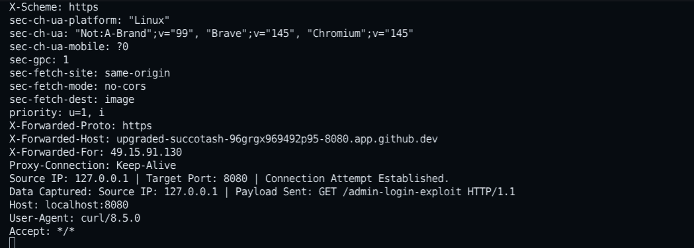
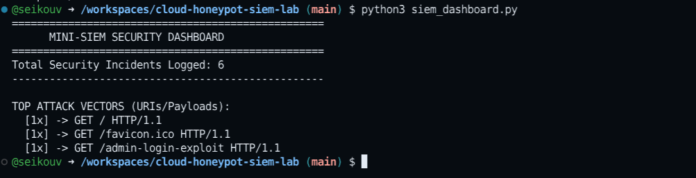

# 🔒 Cloud Honeypot & Mini-SIEM Analytics Lab

## Project Overview
An end-to-end cybersecurity lab built to simulate, capture, and analyze malicious web application traffic. This project features a custom Python-based honeypot acting as a decoy target, paired with a specialized log parser acting as a Security Information and Event Management (SIEM) dashboard to isolate and analyze cyber threats.

---

## Architecture & Component Breakdown

### 1. The Decoy Honeypot (`honeypot.py`)
* Listens continuously on open port `8080`.
* Serves a misleading banner response (`Apache/2.4.41 Ubuntu`) to simulate a vulnerable admin asset.
* Records and drops unauthorized connection requests, capturing the attacker's public IP mapping, HTTP headers, and exploit payloads.

### 2. The Log Engine (`honeypot_activity.log`)
* Aggregates raw data captures with structural timestamps.
* Encapsulates indicators of compromise (IoCs) like unexpected User-Agents (`curl/8.5.0`) and unauthorized targets (`/admin-login-exploit`).

### 3. The Analytics Dashboard SIEM (`siem_dashboard.py`)
* Automates parsing of unstructured file text.
* Renders real-time security data tables highlighting total alerts tripped, primary attack vectors, and specific attacker tools.

---
## 📸 Lab Evidence & Visuals
This screenshot shows the custom Python honeypot live, initialized, and actively listening for incoming threat traffic on Port 8080.


### 2. Live Attack Intrusion Captured
Here, the decoy server successfully intercepts a simulated exploit attempt (`/admin-login-exploit`) via a curl network scan, logging the attacker's metadata.


### 3. Mini-SIEM Analytics Dashboard
The log parsing engine automatically reads the unstructured text logs, running statistical aggregation to present actionable threat intelligence metrics.

## How to Run the Lab

1. Clone this repository inside a secure sandbox or cloud environment:
   ```bash
   git clone https://github.com/seikouv/cloud-honeypot-siem-lab.git
